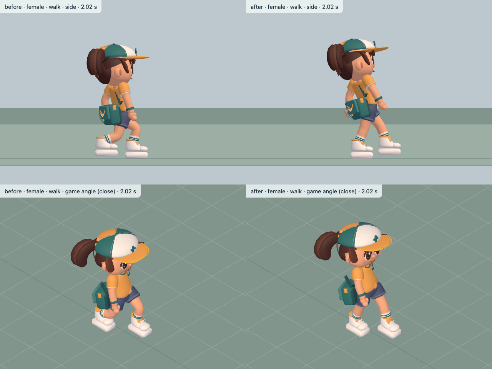
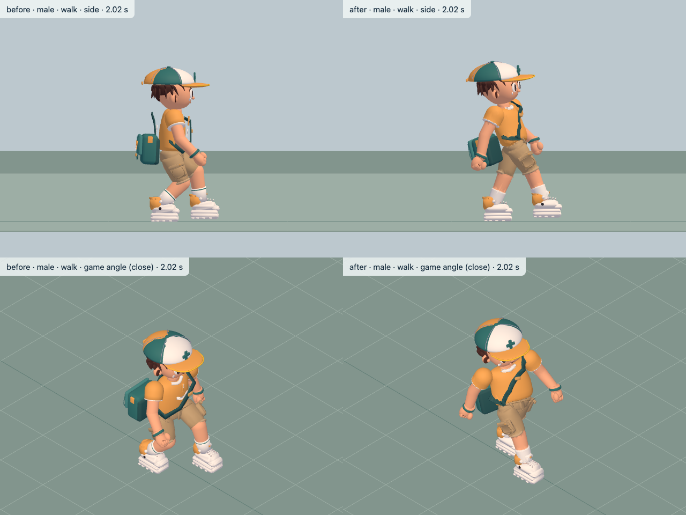

# Courier animation review — 2026-10-07

Branch `lane/player-anim`; animation revisions through `f31df286`, main through `6dee9147`. Default skins enabled in `20d3a85e`; `?skin=0` retains the rigid fallback. Male fitting reuses `skin-rollout`'s `2e151578`. No simulation or specification changes in this lane.

Full report: [decisions, validation and limitations](../../../docs/reports/player-anim.md).
Local motion evidence: [index](../../player-anim/README.md), 18 paired studio WebMs plus two actual L1 WebMs; 96 fixed stills. All videos ≤15 s; all images ≤1600 px wide. Original every-frame poses are retained, including the rigid male baseline.

## Observed and measured

| Measure | Female before → after | Male before → after |
| --- | --- | --- |
| Peak walk knee | 103.0° → 26.1° | 89.2° → 25.3° |
| Peak run knee | 135.5° → 45.0° | 108.0° → 45.0° |
| Straight stance ankle drift, walk/run | <0.01/<0.01 → <0.01/<0.01 cm | 6.93/26.38 → <0.01/<0.01 cm |
| Final CPU p95, worst skinned pose | 0.161 ms | 0.119 ms |

[Measurement details](player-animation-metrics.json), [CPU probe](player-animation-cpu.json). The straight-stance metric tracks the ankle, not a shoe contact patch; turning intentionally releases plants. Female walk is 1.1° above a literal 25° cap. Male cyclic walking pelvis travel increased versus rigid to preserve leg extension/contact. Running pelvis range decreased to 0.75/1.00 cm.

Fixed-time side/game-angle inspection shows upright gait, narrow stop stance and reduced trailing-foot lunge; bicycle sockets remain accurate for both bodies. Authored kick/knee chamber discontinuities were repaired, reducing the worst full-chain leg step from 103.45° during development to 54.44°, while preserving contact poses exactly. The unchanged combat windup still makes knee strikes sharp. Videos are provided for the orchestrator's full cadence/transition review; still inspection is not a claim of final motion approval.

## Checks and limits

Typecheck/lint/build PASS; full unit 266/266, targeted animation 14/14; skin-off and skin-on smoke each 5 simulation + 22 browser PASS. Final E04 rerun PASS: 43 unit/simulation + 27 browser, zero failures/flakes. See full report for final counts and retained build-race failures.

L1 skin A/B final player/simulation state is identical, with zero console/request errors or missing clips. Skin saves 30 draw calls in each sampled scene. No new dependencies or asset licenses. Existing rigid bag straps/bulky sole geometry remain visible in close crops. Mount/dismount remain authored transitions; running cadence is brisk on short legs. WebGPU parity and final subjective motion approval remain manual.
